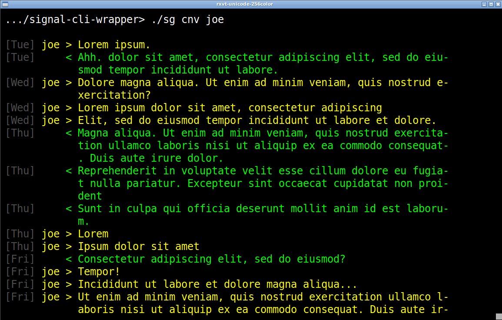

# signal-cli-wrapper

_A `bash` script for easier use of [signal-cli](https://github.com/AsamK/signal-cli)_

Usage: 

 * `sg snd <name> "message"` : Send to a name not a number
 * `sg rcv` : Get messages, which are written to a log file
 * `sg ids` : Check the phone numbers you have keys for
 * `sg ckn <num>` : Test if `<num>` (prefix with `+`) using Signal
 * `sg log` : Read the logs more easily (to see receipts and read-receipts)
 * `sg new` : Show the most recent new messages and confirmations
 * `sg cnv <name>` : Display a conversation:
 


Also included: `checksg` a script to execute `sg rcv` and notify you via
`send-notify`; run it as a `cron` job.

## Installation

 1. Make the scripts executable (`chmod u+x sg`)
 2. Scripts and `signal-cli` must be in the shell’s `$PATH`
 3. Copy the `scw_config.sh` to `~/.local/share/signal-cli/` and assign names 
    to your numbers.
 4. (Optional) Add the full path to `sg` in `checksg` and add `checksg`
    to your `crontab`. E.g.: 

```    
0,10,20,30,40,50 * * * *   /home/foo/bin/checksg
```
